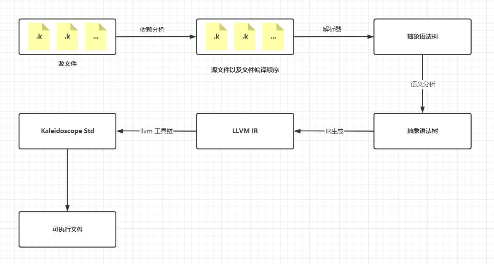

# Kaleidoscope 编译器项目

[**中文**](./README.zn.md)|[**英文**](./README.md)

## 项目介绍

这个项目是一个编译器项目，它实现了一个叫**Kaleidoscope**的编译型语言。这个语言在《LLVM Cookbook》中介绍了。在书中给出的文法基础上，这个项目额外扩展了语言的语法，并支持各种类型。它旨在为Kaleidoscope语言创建一个全新的编译器。这个项目的目的是提高设计编译系统和开发编译器的技能。欢迎每个人都为扩展Kaleidoscope做出贡献，包括语法、静态分析、优化和其它新的功能。

## 提交规范

提交消息的格式，建议按照如下的格式提交，每个提交消息都有类型。有以下几种类型。

```bash
git commit -m "<type> : message"
```

| Type类型 | 描述                                           |
| -------- | ---------------------------------------------- |
| feat     | 添加新功能                                     |
| fix      | 修复BUG                                        |
| docs     | 添加文档                                       |
| style    | 改变代码格式或者代码写法，但是没够改变代码逻辑 |
| refactor | 重构                                           |
| perf     | 性能提升                                       |
| test     | 添加测试用例                                   |
| chore    | 构建过程或者辅助工具的变动                     |
| revert   | 回滚                                           |
| merge    | 代码合并                                       |
| sync     | 同步主线或分支的Bug                            |

## 文法定义

**Token**

```bash
ID, DEF, EXTERN, VOID, BOOL, CHAR, UCHAR, SHORT, USHORT, INT, UINT, LONG, ULONG, FLOAT, DOUBLE, LITERAL, INUMBER, FNUMBER, IF, FOR, WHILE, RETURN, BREAK, CONTINUE, STRUCT IMPORT CONST, IN, THEN, ELSE, COMMENT, SWITCH, CASE, DEFAULT
```

**运算符**

```bash
+ - * / = == != . > >= < <= ! >> >>> << <<< || && | & ^
```

**文法**

```bash
program : (varDef | funcDef | externDef | importDecl )* EOF

typeDecl : (VOID | CHAR | UCHAR | SHORT | USHORT | INT | UINT | LONG | ULONG | FLOAT | DOUBLE | BOOL)

externDef : (varExtern | funcExtern);

varExtern : EXTERN CONST? typeDecl ID ('['expr']')* ';'

funcExtern : EXTERN ID '(' paramList* ')' (':' typeDecl)? ';'

varDef : typeDecl ID ('['expr']')* ('=' initExpr)? ';'

initExpr : expr | '{' expr (',' (expr | initExpr) )* '}' 

funcDef : DEF ID '(' paramList* ')' (':' typeDecl)? blockStmt

importDecl : IMPORT LITERAL ';'

paramList : paramDecl (',' paramDecl)*

paramDecl : typeDecl (ID ('[' expr ']')* ('[' ']')? )?

stmt : (blockStmt | ifStmt | exprStmt | forStmt | whileStmt | returnStmt | breakStmt | continueStmt | switchStmt )

blockStmt : '{' stmt '}'

ifStmt : IF '(' expr ')' THEN stmt (ELSE stmt)?

exprStmt : expr ';'

forStmt : FOR '(' expr ';' expr ';' expr ')' IN stmt

whileStmt : WHILE '(' expr ')' stmt

returnStmt : RETURN expr? ';'

breakStmt : BREAK ';'

continueStmt : CONTINUE ';'

switchStmt SWITCH '(' expr ')' '{' caseStmt* default? '}'

caseStmt : CASE expr ':' stmt

default : DEFAULT ':' stmt
```

## 测试

## 编译流程



## 编译

在编译之前，需要下载下面的依赖

```bash
sudo apt install llvm-(10|12|14)
sudo apt install clang-(10|12|14)
sudo apt install cmake
```

目前项目只支持在Linux下编译

```bash
$> git clone https://github.com/zourenDevote/KaleidoscopeLanguage.git
$> cd KaleidoscopeLanguage
$> mkdir build && cd build
$> cmake ../
$> make -j 'nproc'

# test option
$> ctest -j 'nproc'
```

## Cmake选项

|       选项       |       取值       | 默认值  |               描述               |
| :--------------: | :--------------: | :-----: | :------------------------------: |
| CMAKE_BUILD_TYPE | Release \| Debug | Release | Release version or Debug version |

## 使用

```c
// helloworld.k
extern <kaldstd.k>

def main() : int {
    print("Hello,World!\n");
    return 0;
}
```

```bash
$>./Kaleidoscope helloworld.k -o hello
$>./hello
Hello,World!
```